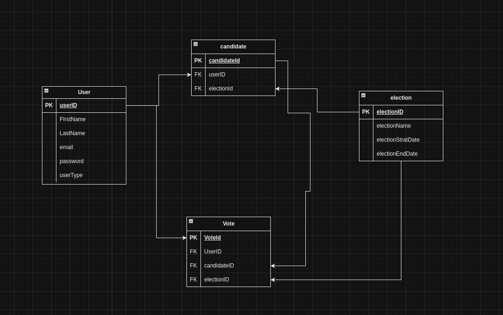

# VOTING SYSTEM

## Description

a voting system where registered users can vote for their preferred candidate.

## Features

- There are two types of users: admin and normal user.
- Only the admin can add candidates for the election.
- Candidates must be registered as normal users.
- Implement measures to prevent duplicate voting.
- Add logging functionality to log events on the server.
- Ensure secure and unique user authentication.

## dbmodel


## EXPLAINING THE MODEL

in this voting system , i decided to created 3 tables :
- users : to store the users information
- candidates : to store the candidates information
- votes : to store the votes information


i did it this way because a user can be a candidate in many elections and a candidate can be a user in many elections, so i decided to create a table for the users and another table for the candidates 
and an election can have multiple candidates so the way is to go with many to many relationship between the users and the candidates.

for the pk , it was enough to use the composite key (user_id, election_id) as the primary to make sure that the user can be a candidate only once in the same election.
but i choose to extract a candidate_id ([Surrogate key](https://en.wikipedia.org/wiki/Surrogate_key#:~:text=A%20surrogate%20key%20(or%20synthetic,natural%20(or%20business)%20key.))
so i can use it as a foreign key in the votes table to make the relationship between the votes and the candidates but since i used a surrogate key i had to add a unique constraint on the (user_id, election_id) to make sure that the user can  only be candidate once in the same election.

for the vote table i decided to make ternary relationship between the users, candidates and the elections to make sure that the user can vote only once for the same candidate in the same election.
even if the candidate has the election id as a foreign key but i decided to add it as a column in the vote table to make the relationship between the votes and the elections so i can control that the user can only vote once
in an election , and i added another constraint to make sure the user can vote once to the same candidate even if it is always controlled by the fact that the user can only vote once in an election and a candidate can exist only once in an election , so a user cannot vote for a candidate more than once in the same election.


## Security

- I used JWT for authentication and authorization.
- I added a filter to check the token and validate the user.
- I added a role based mechanism to control the access to the endpoints.
- I added a secret key to sign the token.
- I added unique constraints to prevent duplicate voting.
- I added a unique constraint to prevent the user from being a candidate more than once in the same election.
- I added a unique constraint to prevent the user from voting more than once for the same candidate in the same election.
- I added a unique constraint to prevent the user from voting more than once in the same election.


## REQUIREMENTS

- Java 22
- Maven
- Postgres

## installation

- clone the project
- create application-local.properties file and add the following variables

```
DB_URL=
DB_USER=
DB_PASSWORD=
DB_NAME=
JWT_SECRET=
```

- run the project
- a note : make sure to add the information as i mentioned in the application-local.properties file
```
 mvn spring-boot:run
```

## API

```
http://localhost:8080/swagger-ui.html
```

## WEB APP
```
http://localhost:8080/index.html
```
